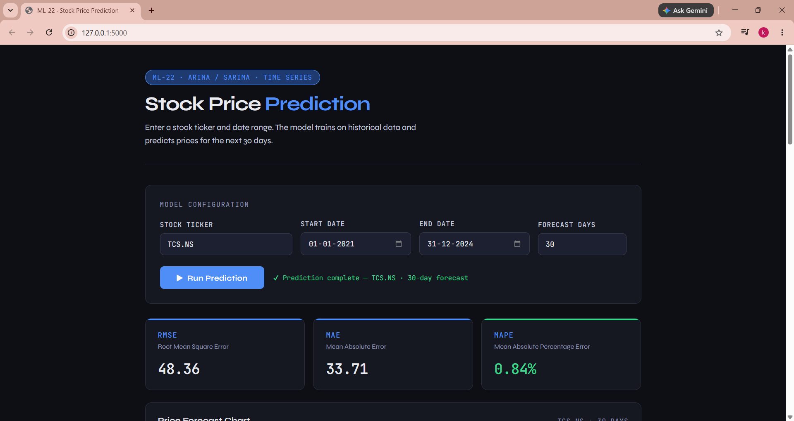
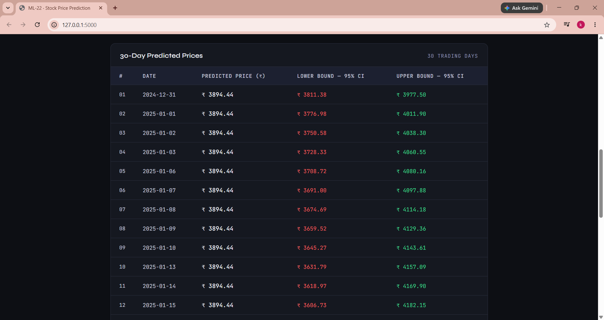
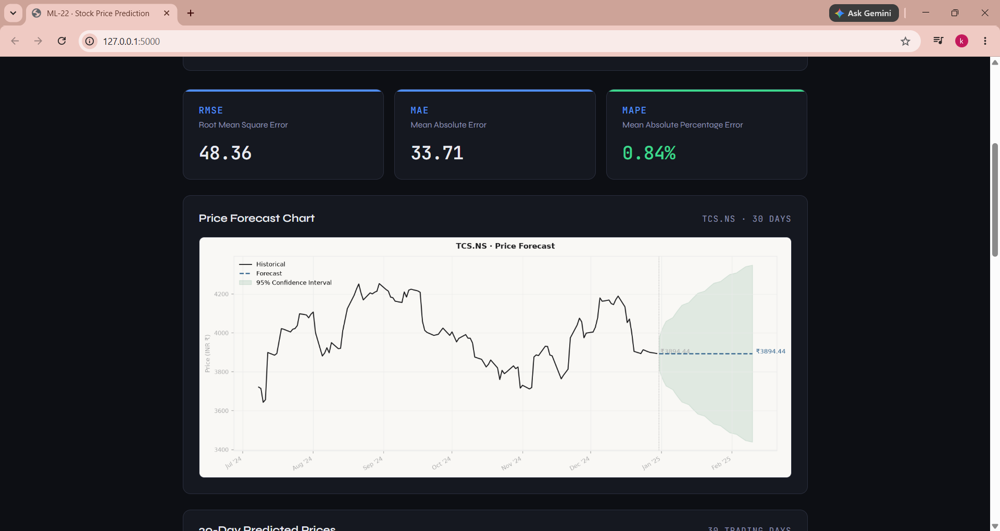

# 📈 Stock Price Prediction using ARIMA/SARIMA

A Flask-based Machine Learning web application that predicts future stock prices using ARIMA/SARIMA Time Series Forecasting models.

## Features

- Download real-time stock data using Yahoo Finance
- Data preprocessing and cleaning
- Automatic ARIMA parameter selection using auto_arima
- Train ARIMA/SARIMA forecasting model
- 30-day stock price prediction
- Interactive Flask web interface
- Historical vs Forecast visualization
- Model evaluation using RMSE, MAE, and MAPE

## Tech Stack

- Python
- Flask
- Pandas
- NumPy
- Matplotlib
- Statsmodels
- pmdarima
- scikit-learn
- yfinance
- Joblib

## Project Structure

```
Stock-Price-Prediction/
│
├── app.py
├── train.py
├── predict.py
├── requirements.txt
├── templates/
├── data/
├── model/
└── results/
```

## Installation

```bash
git clone https://github.com/yourusername/Stock-Price-Prediction.git

cd Stock-Price-Prediction

python -m venv venv

venv\Scripts\activate

pip install -r requirements.txt
```

## Run

```bash
python app.py
```

Open

```
http://localhost:5000
```

## Model

- ARIMA
- SARIMA
- Walk Forward Validation

## Evaluation Metrics

- RMSE
- MAE
- MAPE

## Future Improvements

- LSTM Model
- Prophet Forecasting
- Live Stock Dashboard
- Multiple Stock Comparison

## Author

**Sanjeevani Katakamshetty**

## 📸 Screenshots

### 🏠 Home Page



---

### 📈 Prediction Result



---

### 📊 Forecast Graph

